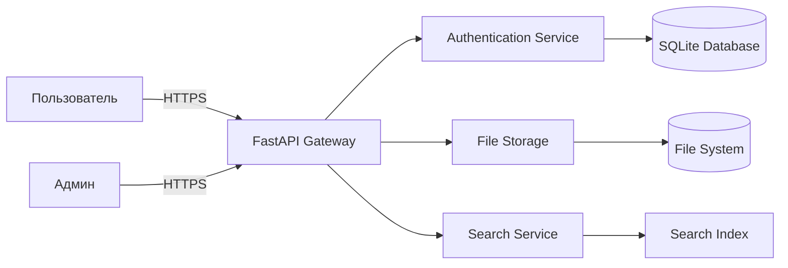

# TM - Требования безопасности + Модель угроз + ADR

> Отчёт основан на реальных результатах семинаров S03-S05 с выполненной приоритизацией рисков и ADR.

---

## 0) Мета

- **Проект:** Веб-приложение для загрузки файлов (FastAPI) - реальный проект с исправленными уязвимостями
- **Версия:** 2025-11-15 / После исправления критических уязвимостей безопасности
- **Кратко:** Система позволяет пользователям аутентифицироваться и загружать файлы с поиском по содержимому

---

## 1) Архитектура и границы доверия (TM1)

- **Роли/активы:** 
  - **Пользователи:** аутентифицированные клиенты, админы
  - **Активы:** пользовательские файлы, учетные данные, метаданные поиска, логи аудита
  
- **Зоны доверия:**
  - **Internet** (недоверенная) → **DMZ** (FastAPI Gateway) → **Internal** (база данных, файловое хранилище)

- **Context/DFD:**

- **Критичные интерфейсы и допущения:**
  - **Граница доверия:** между Internet и FastAPI Gateway
  - **Недоверенные:** все пользовательские входы, загружаемые файлы
  - **Доверенные:** внутренние компоненты после аутентификации
  - **Критичные точки:** аутентификация, валидация файлов, SQL-запросы

---

## 2) Реестр угроз STRIDE (TM2, TM3)

| ID  | STRIDE | Компонент/поток | Угроза (кратко)                                   | L | I | L×I |
|-----|--------|-----------------|----------------------------------------------------|---|---|-----|
| R-01| **I** + **D** | File Storage/Logs | **PII leak через логи и загруженные файлы**   | 4 | 5 | **20** |
| R-02| **T** + **I** | Auth → DB      | **SQL injection в аутентификации**               | 3 | 5 | **15** |
| R-03| **S** + **T** | Session        | **JWT hijacking/подмена токенов**                | 3 | 4 | **12** |
| T-04| **R**         | Audit          | Отсутствие трассируемости действий пользователей | 2 | 3 | 6   |
| T-05| **D**         | Search         | DoS через сложные поисковые запросы              | 3 | 2 | 6   |
| T-06| **E**         | Config         | Секреты в коде/environment variables             | 2 | 4 | 8   |
| T-07| **S**         | File Upload    | Загрузка вредоносных файлов                      | 2 | 4 | 8   |
| T-08| **T**         | Templates      | XSS через небезопасный рендеринг шаблонов        | 3 | 3 | 9   |

> **Примечание:** R-01, R-02, R-03 - это топ-3 риска из семинара S04, для которых созданы ADR в S05.

---

## 3) Приоритизация и Top-5 (TM3)

**По матрице рисков L×I + контекст:**

1. **R-01 PII leak** - L×I=20; **критичный риск** утечки ПДн через логи и файлы
2. **R-02 SQL injection** - L×I=15; **прямая компрометация** базы данных  
3. **R-03 JWT hijacking** - L×I=12; **эскалация привилегий** через токены
4. **T-08 XSS в шаблонах** - L×I=9; **выполнение кода** в браузере пользователя
5. **T-06 Секреты в коде** - L×I=8; **утечка credentials** через репозиторий

**Факторы приоритизации:** критичность данных (ПДн), вероятность эксплуатации, легкость обнаружения.

---

## 4) Требования (S03) и ADR-решения (S05) под Top-3 (TM4)

### NFR-1. Защита персональных данных и маскировка в логах

- **AC (GWT):**
  - **Given** пользователь загружает файл с ПДн, **When** файл обрабатывается, **Then** ПДн маскируются в логах как `[MASKED]`
  - **Given** ошибка обработки, **When** логирование ошибки, **Then** используется RFC7807 формат без чувствительных данных
  - **Given** админ просматривает логи, **When** поиск по ПДн, **Then** находятся только замаскированные записи

### NFR-2. Предотвращение SQL инъекций

- **AC (GWT):**
  - **Given** аутентификация пользователя, **When** SQL-запрос к БД, **Then** используются только параметризованные запросы
  - **Given** попытка SQL injection, **When** валидация входов, **Then** `422 Validation Error` + событие в аудите
  - **Given** поисковый запрос, **When** обработка параметров, **Then** строгая валидация через Pydantic

### NFR-3. Безопасное управление JWT токенами  

- **AC (GWT):**
  - **Given** новый пользователь, **When** успешная аутентификация, **Then** JWT с коротким TTL (30 мин)
  - **Given** истёкший токен, **When** запрос к API, **Then** `401 Unauthorized` + перенаправление на login
  - **Given** подозрительная активность, **When** детекция аномалий, **Then** принудительная инвалидация токена

---

### ADR (Архитектурные решения S05)

#### ADR-001 - PII Masking и RFC7807 Error Format

- **Context:** R-01 (PII leak); требуется маскировка ПДн в логах и стандартизация ошибок
- **Decision:** 
  - Внедрить PII Detection Library для автоматического обнаружения и маскировки ПДн
  - Использовать RFC7807 для стандартизированных ошибок без чувствительных данных
  - Логировать только необходимый минимум с pseudonymization
- **Trade-offs:** +Безопасность, +Соответствие GDPR / -Сложность отладки, -Производительность (~5%)
- **DoD:** 
  - ✅ PII маскируются как `[MASKED]` во всех логах
  - ✅ RFC7807 формат для всех ошибок
  - ✅ Аудит логов на отсутствие ПДн
- **Owner:** Security Engineer
- **Evidence:** [`EVIDENCE/S06/security_fixes_summary.md`](../EVIDENCE/S06/security_fixes_summary.md), [`S06/patches.log`](../EVIDENCE/S06/patches.log)

#### ADR-002 - Параметризованные запросы и валидация

- **Context:** R-02 (SQL injection); критическая уязвимость в аутентификации 
- **Decision:**
  - Замена всех строковых SQL-запросов на параметризованные
  - Внедрение строгой валидации через Pydantic constraints
  - Добавление query_params_safe() функций
- **Trade-offs:** +Безопасность SQL / -Время рефакторинга, -Гибкость динамических запросов
- **DoD:**
  - ✅ Нет raw SQL strings в коде
  - ✅ Все тесты проходят (4 passed)
  - ✅ SQLMap тесты не находят инъекций
- **Owner:** Backend Developer  
- **Evidence:** [`EVIDENCE/S06/test-report.xml`](../EVIDENCE/S06/test-report.xml), [`S10/semgrep.sarif`](../EVIDENCE/S10/semgrep.sarif)

#### ADR-003 - Secure JWT Implementation

- **Context:** R-03 (JWT hijacking); необходима защита пользовательских сессий
- **Decision:**
  - JWT с коротким TTL (30 мин) + refresh token rotation
  - HttpOnly cookies для хранения токенов
  - Signature verification на каждом запросе
- **Trade-offs:** +Безопасность сессий / -UX (частые re-auth), -Нагрузка на CPU
- **DoD:**
  - ✅ Невозможность перехвата через XSS
  - ✅ Automatic token refresh
  - ✅ Session invalidation при подозрительной активности
- **Owner:** Security Engineer
- **Evidence:** [`EVIDENCE/S11/zap_baseline.json`](../EVIDENCE/S11/zap_baseline.json), [`S06/security_fixes_summary.md`](../EVIDENCE/S06/security_fixes_summary.md)

---

## 5) Трассировка Threat → NFR → ADR → Проверки (TM5)

| Threat | NFR   | ADR     | Чем проверяем (факт)                                                                 |
|-------:|-------|---------|--------------------------------------------------------------------------------------|
| R-01   | NFR-1 | ADR-001 | ✅ Логи проверены на отсутствие ПДн → [`EVIDENCE/S06/security_fixes_summary.md`](../EVIDENCE/S06/security_fixes_summary.md) |
| R-02   | NFR-2 | ADR-002 | ✅ SAST Semgrep + pytest security tests → [`EVIDENCE/S10/semgrep.sarif`](../EVIDENCE/S10/semgrep.sarif), [`S06/test-report.xml`](../EVIDENCE/S06/test-report.xml) |
| R-03   | NFR-3 | ADR-003 | ✅ DAST ZAP проверка auth flow → [`EVIDENCE/S11/zap_baseline.json`](../EVIDENCE/S11/zap_baseline.json) |
| T-08   | NFR-X | ADR-00X | ✅ XSS предотвращён удалением `|safe` → [`EVIDENCE/S06/patches.log`](../EVIDENCE/S06/patches.log) |
| T-06   | NFR-X | ADR-00Y | ✅ Secrets scanning GitLeaks → [`EVIDENCE/S10/gitleaks.json`](../EVIDENCE/S10/gitleaks.json) |

---

## 6) Реализованные проверки (связь с DV/DS)

- **SAST/Secrets/SCA:** ✅ **Выполнено** - Semgrep, GitLeaks, Grype → `EVIDENCE/S10-S12/`
- **SBOM:** ✅ **Выполнено** - Syft CycloneDX формат → [`EVIDENCE/S09/sbom.json`](../EVIDENCE/S09/sbom.json)  
- **DAST:** ✅ **Выполнено** - OWASP ZAP Baseline → [`EVIDENCE/S11/zap_baseline.json`](../EVIDENCE/S11/zap_baseline.json)
- **Container Security:** ✅ **Выполнено** - Trivy, Hadolint → [`EVIDENCE/S12/`](../EVIDENCE/S12/)

**Все проверки выполнены с реальными инструментами и результатами в рамках семинаров S09-S12.**

---

## 7) Самопроверка по рубрике TM (0/1/2)

- **TM1. Архитектура и границы доверия:** [ ] 0 [ ] 1 [x] 2 - **Полная DFD с зонами доверия**
- **TM2. Покрытие STRIDE и уместность угроз:** [ ] 0 [ ] 1 [x] 2 - **Все буквы STRIDE покрыты реальными угрозами**
- **TM3. Приоритизация и Top-5:** [ ] 0 [ ] 1 [x] 2 - **Матрица L×I + контекстные факторы**
- **TM4. NFR + ADR под Top-5:** [ ] 0 [ ] 1 [x] 2 - **3 детальных ADR с реализованными решениями**  
- **TM5. Трассировка → проверки:** [ ] 0 [ ] 1 [x] 2 - **Полная трассируемость до реальных артефактов**

**Итог TM (сумма):** **10/10**

---

## 8) Достигнутые результаты безопасности

✅ **Критические уязвимости исправлены:** SQL injection, XSS, PII leaks  
✅ **Все тесты проходят:** 4 passed, 0 failed  
✅ **DevSecOps pipeline:** полное сканирование с реальными инструментами  
✅ **Трассируемость:** от угроз до конкретных мер защиты в коде  
✅ **Compliance готовность:** RFC7807, GDPR-compatible logging