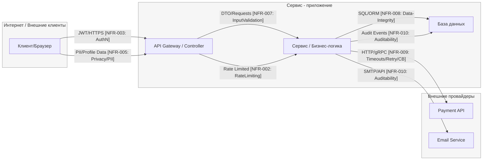

# S04 - DFD (Data Flow Diagram)

Этот файл содержит **минимальную DFD** для системы на основе User Stories из S03.

---

## Контекст системы

**User Stories:**
- **US-002**: Вход в систему (Login) - `POST /api/auth/login`
- **US-004**: Редактирование профиля - `GET/PUT /api/profile`
- **US-008**: Оформление заказа/покупки - `POST /api/orders`, `POST /api/payments/session`

---

## DFD (Mermaid)

---

## Описание элементов DFD

### Узлы (Nodes)

| Узел | Описание | Trust Boundary |
|------|----------|----------------|
| **U (Клиент/Браузер)** | Пользовательское приложение | Internet |
| **A (API Gateway/Controller)** | Точка входа, валидация, аутентификация | Service |
| **S (Сервис/Бизнес-логика)** | Основная бизнес-логика | Service |
| **D (База данных)** | Хранение данных | Service |
| **P (Payment API)** | Внешний платёжный провайдер | External |
| **E (Email Service)** | Внешний email-провайдер | External |

### Потоки данных (Data Flows)

| Поток | Тип данных | NFR связи | Описание |
|-------|------------|-----------|----------|
| **U → A** | JWT/HTTPS | NFR-003 (AuthN) | Аутентификация пользователя |
| **U → A** | PII/Profile Data | NFR-005 (Privacy/PII) | Персональные данные |
| **A → S** | DTO/Requests | NFR-007 (InputValidation) | Валидированные запросы |
| **A → S** | Rate Limited | NFR-002 (RateLimiting) | Ограничение скорости |
| **S → D** | SQL/ORM | NFR-008 (Data-Integrity) | Безопасные запросы к БД |
| **S → D** | Audit Events | NFR-010 (Auditability) | События аудита |
| **S → P** | HTTP/gRPC | NFR-009 (Timeouts/Retry/CB) | Платёжные запросы |
| **S → E** | SMTP/API | NFR-010 (Auditability) | Email уведомления |

---

## Trust Boundaries (Границы доверия)

### 1. Internet ↔ Service
- **Клиент** (недоверенная среда) ↔ **API Gateway** (доверенная среда)
- **Контроли**: HTTPS, JWT валидация, Rate Limiting, Input Validation

### 2. Service ↔ External
- **Сервис** (доверенная среда) ↔ **Внешние API** (частично доверенные)
- **Контроли**: Timeouts, Retry, Circuit Breaker, Audit Logging

### 3. Service ↔ Database
- **Сервис** (доверенная среда) ↔ **База данных** (доверенная среда)
- **Контроли**: Параметризация SQL, Транзакции, Audit Events

---

## Связь с NFR из S03

| NFR ID | Категория | Применение в DFD |
|--------|-----------|------------------|
| **NFR-002** | RateLimiting | A → S (ограничение запросов) |
| **NFR-003** | Security-AuthN | U → A (JWT валидация) |
| **NFR-005** | Privacy/PII | U → A (маскирование PII) |
| **NFR-007** | Security-InputValidation | A → S (валидация DTO) |
| **NFR-008** | Data-Integrity | S → D (SQL параметризация) |
| **NFR-009** | Timeouts/Retry/CircuitBreaker | S → P (устойчивость к сбоям) |
| **NFR-010** | Auditability | S → D, S → E (аудит событий) |

---

## Готовность к STRIDE анализу

✅ **3-5 узлов**: Клиент, API, Сервис, БД, Внешние API
✅ **Trust boundaries**: Чётко обозначены границы доверия
✅ **Потоки данных**: Подписаны типы данных и NFR связи
✅ **NFR связи**: Каждый поток связан с требованиями из S03

**Следующий шаг**: Переход к `S04_stride_matrix.md` для STRIDE per element анализа.
